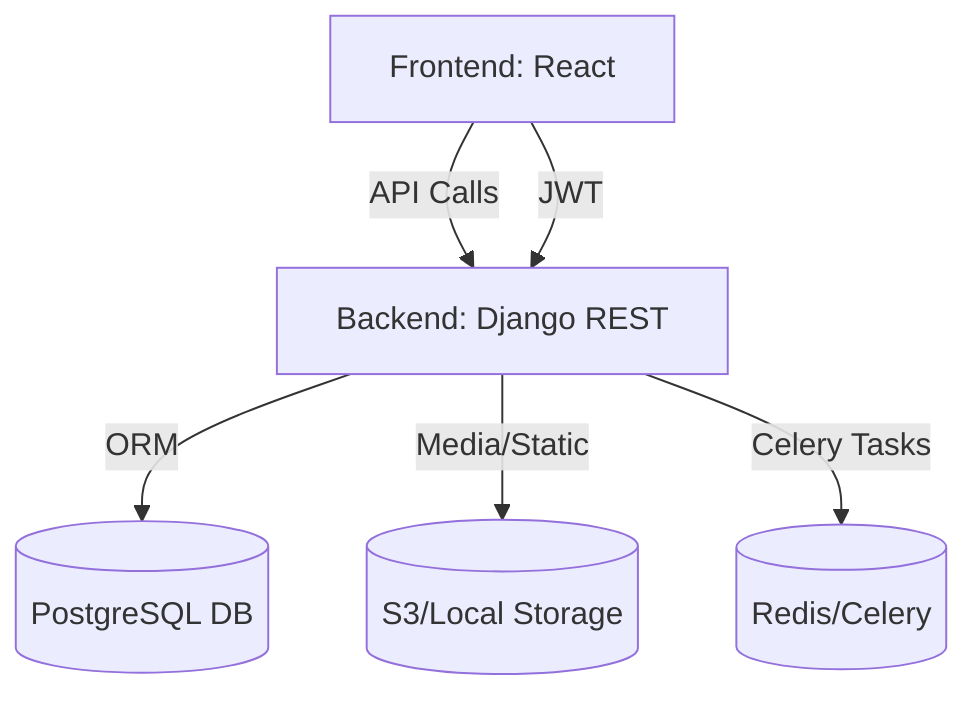

# JustClothing App Documentation

---

## Table of Contents
- [Overview](#overview)
- [Technologies Used](#technologies-used)
- [Project Structure](#project-structure)
  - [Backend Structure](#backend-structure)
  - [Frontend Structure](#frontend-structure)
- [Key Components & Responsibilities](#key-components--responsibilities)
- [Data Flow & API Communication](#data-flow--api-communication)
- [Authentication & Authorization](#authentication--authorization)
- [Seller & Customer Flows](#seller--customer-flows)
- [Deployment & Development Notes](#deployment--development-notes)

---

## Overview
JustClothing is a full-stack e-commerce platform for clothing retailers, supporting both customer and seller experiences. It features user authentication, product management, order processing, reviews, analytics, and seller onboarding/approval.

---

## Technologies Used
- **Frontend:** React (Vite), Zustand (state), Tailwind CSS, React Router
- **Backend:** Django, Django REST Framework, SimpleJWT, PostgreSQL, Celery, Redis
- **Other:** Docker, Nginx, Swagger (drf-yasg), S3 (optional), Health checks

---

## Project Structure

### Root
```
/JustClothing
├── backend/
├── frontend/
├── docker-compose.yml
├── nginx.conf
├── README.md
└── ...
```

### Backend Structure
```
backend/
├── justclothing/         # Django project root (settings, urls, wsgi/asgi, celery)
├── users/                # User model, auth, registration, profile
├── sellers/              # Seller profile, onboarding, approval
├── products/             # Product catalog, categories, collections
├── orders/               # Order management
├── stores/               # Store management
├── reviews/              # Product/store reviews
├── promotions/           # Promotions, featured products
├── analytics/            # Analytics endpoints
├── static/, media/       # Static/media files
├── requirements.txt      # Python dependencies
└── ...
```

#### Key Backend File Relationships
- `justclothing/settings.py`: Project-wide settings, apps, middleware, JWT, CORS, DB, Celery
- `justclothing/urls.py`: Main API routing, includes all app URLs
- `users/models.py`: Custom user model (with user_type, is_verified, etc.)
- `users/serializers.py`: User registration, profile, and auth serializers
- `users/views.py`: Registration, login, profile, logout endpoints
- `sellers/models.py`: SellerProfile, links to User
- `sellers/views.py`: Seller onboarding, approval, profile endpoints
- `products/`, `orders/`, `stores/`, etc.: Standard Django app structure (models, views, serializers, urls)

### Frontend Structure
```
frontend/
├── src/
│   ├── components/       # Shared UI/layout components
│   ├── pages/            # Route-based pages (auth, customer, seller, shared)
│   ├── services/         # API logic (api.js), interceptors
│   ├── store/            # Zustand stores (user, cart, product)
│   ├── context/          # React context providers
│   ├── assets/           # Images, icons, etc.
│   └── ...
├── public/               # Static assets
├── package.json          # JS dependencies
└── ...
```

#### Key Frontend File Relationships
- `src/App.jsx`: Main router, route protection, layout
- `src/pages/`: Route-based pages (auth, customer, seller, shared)
- `src/components/layout/`: Header, Footer, SellerHeader, SellerLayout
- `src/services/api.js`: All API calls to backend (login, register, products, orders, seller signup, etc.)
- `src/store/useUserStore.js`: Auth state, user info, login/logout/register logic
- `src/store/useCartStore.js`: Cart state
- `src/pages/seller/SellerSignupFormPage.jsx`: Seller registration, auto-fills from user store

---

## Key Components & Responsibilities

### Backend
- **User Model:** Custom, supports multiple user types (customer, seller, admin, etc.)
- **SellerProfile:** Linked to User, stores seller-specific info, onboarding/approval
- **Views/Serializers:** Handle registration, login, seller onboarding, product/order/review CRUD
- **Celery/Redis:** Background tasks (emails, analytics, etc.)
- **JWT Auth:** Token-based authentication for API

### Frontend
- **Zustand Stores:** Manage user, cart, product state globally
- **API Service:** Centralizes all backend communication
- **Route Protection:** Guards for customer/seller-only pages
- **Auto-population:** Seller signup form pre-fills from user info
- **Responsive UI:** Modern, mobile-friendly design

---

## Data Flow & API Communication

### Registration/Login
1. **Frontend:** User submits registration/login form
2. **API Call:** `POST /api/v1/auth/register/` or `/api/v1/auth/login/`
3. **Backend:** Validates, creates user, returns JWT tokens
4. **Frontend:** Stores tokens, updates Zustand user store

### Seller Onboarding
1. **Frontend:** User clicks "Become a seller" (redirects to login if not authenticated)
2. **SellerSignupFormPage:** Auto-fills info from user store
3. **API Call:** `POST /api/v1/sellers/signup/` with seller info
4. **Backend:** Creates SellerProfile (links to User if exists)
5. **Admin Approval:** Admin approves seller (updates user_type, is_verified, links SellerProfile)
6. **Frontend:** User can now access seller dashboard/routes

### Product/Order/Review
- **CRUD APIs:** Standard REST endpoints for products, orders, reviews
- **Frontend:** Uses `api.js` to fetch, create, update, delete
- **State:** Updates Zustand stores as needed

### Diagram: Data Flow


---

## Authentication & Authorization
- **JWT Tokens:** Used for all protected API endpoints
- **Zustand user store:** Holds tokens, user info, handles login/logout
- **Route Guards:** `ProtectedRoute`, `SellerProtectedRoute` restrict access based on user type/verification
- **Auto-redirect:** Unauthenticated users are redirected to login, then back to intended page

---

## Seller & Customer Flows

### Customer
- Register/Login
- Browse products, add to cart, checkout
- View orders, leave reviews

### Seller
- Register/Login
- Click "Become a seller" (auto-fills info)
- Submit seller application
- Wait for admin approval
- Once approved, access seller dashboard, add/manage products, view orders, analytics

---

## Deployment & Development Notes
- **Docker Compose:** Orchestrates backend, frontend, db, redis, celery, nginx
- **.env/config.env:** Store secrets, DB credentials, etc.
- **Static/Media:** Served via Nginx in production
- **Swagger:** API docs at `/swagger/`
- **Health Checks:** `/health/` endpoint
- **Dev:** Hot reload for frontend (Vite) and backend (Django)

---

## Relationships & Data Transfer Summary
- **Frontend** communicates with **Backend** via REST API (JSON, JWT auth)
- **Backend** uses Django ORM to interact with **PostgreSQL**
- **SellerProfile** links to **User** (one-to-one)
- **Products, Orders, Reviews** all relate to users and stores via foreign keys
- **State** is managed in frontend via Zustand, synced with backend via API

---

## Contact & Contribution
- See `README.md` for setup, contribution, and contact info.

---

*Generated by AI documentation assistant.* 